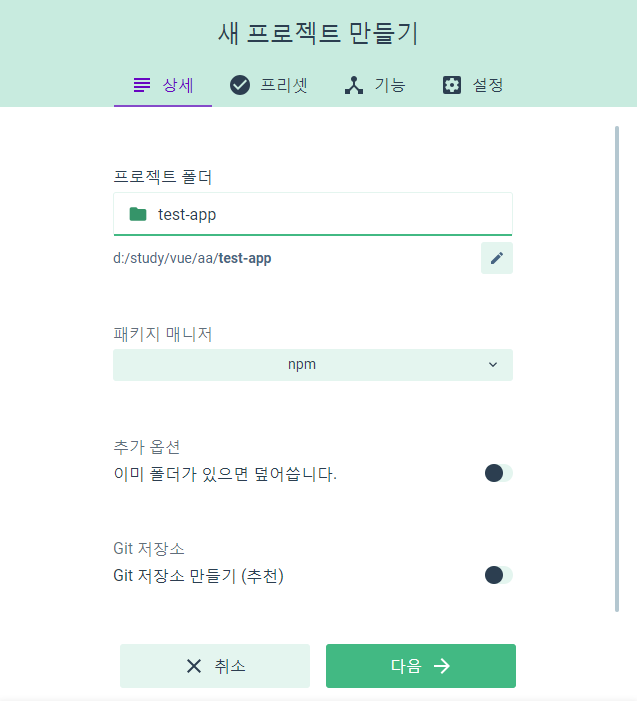

#VUE 설치

##환경세팅
NPM(Node Package Manager) 을 사용하기 위해 node.js 우선 설치.

##NPM 명령어
###vue 2.x 설치
```
npm install vue  //초기
npm install -g vue-cli //vue command line 
vue init webpack (or webpack-simple) [project name] //프로젝트 이름으로 폴더생성 + 구조설정
cd [project name] //프로젝트 이름의 폴더로 이동
npm install //기본설정 설치
npm run dev //로컬에서 서버구동
```
###vue 3.x 설치
```
npm install -g @/vue/cli
vue create [project name] 
        or 
vue ui
cd [project name]
npm run serve //로컬에서 서버구동
```
> vue create시, 아래와 같이 터미널에서 필요한 라이브러리를 선택, 설치할 수 있음.  
  

> vue ui로 설치시 아래와 같이 브라우저에서 프로젝트 생성가능.
  

\* *[참고]직접 `<script></script>`에 추가하여 특정페이지에 부분적용 가능.*

## VUE2와 VUE3 차이점
* vue3는 프로젝트 설치 GUI를 제공
* vue-router 와 vuex 라이브러리를 추가설치 시, 명령어 변경됨.
```
    //vue2.x
    npm install --save vue-router
    npm install --save vuex

    //vue3.x
    vue add router
    vue add vuex
```
* 개발서버 구동 명령어 변경
```
    npm run serve
```
* ~~webpack.config.js~~ 파일이 vue3에서는 사라지고, **vue.config.js**에 선언.  
(작성방식은 동일)