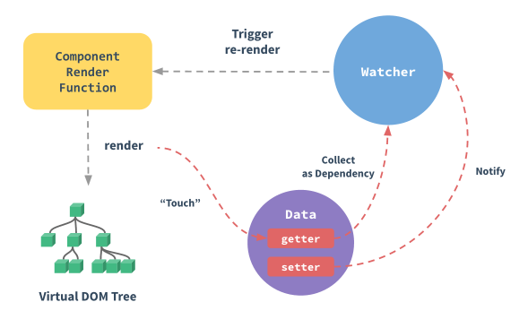

#VUE INSTANCE

new Vue 생성자를 통해, 화면 단위로 사용될 data 및 함수, 라이프사이클, 마운트할 엘리먼트 등을 정의 함.  

*\* 주의 : data : function(){ return {}} 와 같이 data 속성을 정의하지 않으면, 모든 컴포넌트에서 데이터 조작이 가능해지므로 해당 컴포넌트의 스코프로 지정해야 함.*

```javascript
var vm = new Vue({
    el : '#app',
    data : function(){
        return {
            message : 'hi'
        }
    },
    components : {

    },
    methods : {
        welcome : function(){
            console.log(this.message);
        }
    },
    computed : {
        hi : function(){
            return this.message;
        }
    },
    watch:{
        message : function(value){
            this.message = value + " world!!";
        }
    },
    created : function(){},
    mounted : function(){}
    //something to do...
});
```

##computed vs watch vs methods 차이
###* computed
계산형 함수로, 데이터의 변경이 발생하면, 해당 부분만 다시 계산.

###* watch
data 속성을 함수로 연결하여, 변경이 발생하는 것을 직접 감시.

###* methods
데이터의 변경과 상관없이, 호출될 때 전체를 다시계산.

##반응성 주입
data에 정의된, 모든 속성들은 Object.defineProperty를 사용하여 getter/setter로 변환.  
(Object.defineProperty는 ES5속성으로 Vue는 IE8에서 지원되지 않음.)  
즉, data속성을 수시로 감지할 수 있는 watcher가 붙어 변경 시, 컴포넌트가 다시 렌더링 됨.  
  
[자세히알기](https://vuejs.org/v2/guide/reactivity.html)
>**반응성 관련속성**
> - data
> - computed
> - watch
